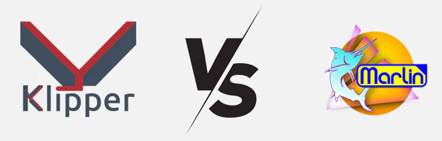

# برد کنترلر پرینترهای سه بعدی ماژولار ORCA 3D SPRINGER دارای پردازنده 32 بیتی و امکانات کامل

**
 برد کنترلر پرینتر سه بعدی ماژولار ORCA 3D SPRINGER یک برد کامل برای تمامی پرینتر های سه بعدی با امکانات کامل و ویژه ای است که میتواند هر دستگاه پرینتر سه بعدی را با بروزترین امکانات موجود دنیای پرینترهای سه بعدی تجهیز کند. این برد کنترلر با هدف فراهم کردن بروزترین امکانات برای تمامی پرینتر های سه بعدی طراحی و تولید شده است. 
** 

 امکانات ویژه ای مانند بهره برداری از پردازنده 32 بیتی، ارتباط از طریق پورت USB یا پورت Canbus، پشتیبانی از 8 محور مجزا با درایور های هوشمند SPI/UART و حتی درایور های قدیمی مانند A4988 یا DRV8825، پشتیبانی از 5 ترمیستور مجزا، پشتنیبانی از 3 انداستاپ با سطح ولتاژ 3.3 یا 5 ولت، پشتیبانی از پروب های سطح هیت بد، پشتیبانی از نمایشگر های 128در64، پشتیبانی از نمایشگر های تاچ رنگی، پشتیبانی از هیت بد 12،24 و 220 ولت (با رله SSR)، پشتیبانی از چهار هیتر اکسترودر، پشتیبانی از 4 فن مجزا با سطح ولتاژ 5، 12 یا 24 ولت، خروجی 5 ولت مجزا برای برد های رزبری پای یا مشابه این برد کنترلی را از سایر رقبا برتر میسازد. 

## مشخصات سخت افزاری

* پردازنده 32 بیتی ARM Cortex-M3 به شماره STM32F103 با قابلیت آپگرید به ARM Cortex™-M4 core به شماره STM32F407
* قابلیت راه اندازی از طریق پورت ارتباطی USB، پورت ارتباطی Canbus یا ارتباط بی سیم از طریق WiFi
* قابلیت پشتیبانی از 8 استپر موتور مجزا با قابلیت راه اندازی درایور های هوشمند SPI/UART
* قابلیت پشتیبانی از 5 ترمیستور NTC مجزا
* قابلیت پشتیبانی از 3 انداستاپ با سطح ولتاژ 3.3 ولت یا 5.0 ولت
* قابلیت پشتیبانی از پروب سطح هیت بد Auto Bed Leveling Sensors
* قابلیت پشتیبانی از نمایشگر های 128 در 64
* قابلیت پشتیبانی از نمایشگر های تاچ رنگی
* قابلیت پشتیبانی از هیت بد های 12 ولت، 24 ولت و 220 ولت با توان بالا
* قابلیت پشتیبانی از چهار اکسترودر 12 یا 24 ولت به صورت همزمان
* قابلیت پشتیبانی از چهار فن مجزا با سطح ولتاژ 5 ولت، 12 ولت یا 24 ولت
* قابلیت پشتیبانی از برد های تک کامپیوتری مثل رزبری پای با قابلیت تغذیه برد ها از طریق خروجی مجزا 5 ولت 2 آمپری

# بخش های مختلف کنترلر ماژولار ORCA 3D SPRINGER

 برد کنترلر ماژولار ORCA 3D SPRINGER همانطور که از اسمش مشخص است تشکیل شده از چند ماژول مختلف است که توسط کابل های فلت به یکدیگر متصل میشوند. این کانفیگ ماژولار دسترسی راحت تر و امکانات بیشتری را برای مصرف کنندگان فراهم میکند. 
  

 این کنترلر تشکیل شده از یک مادربرد اصلی، یک برد تغذیه و دو برد درایور است. این ویژگی منحصر به فرد برد های کنترلر ORCA 3D SPRINGER این امکان را فراهم میسازد تا علاوه بر ارائه امکانات بیشتری که در برد های کنترلر تک بردی امکان ارائه آن امکانات وجود ندارد فراهم شود و هم در هر زمان از دوره استفاده از دستگاه هر بخشی نیازمند آپگرید یا تعویض شد بتواند به راحتی انجام شود و نیازمند تعویض کل برد کنترلر نباشد. 

# مادربرد کنترلر ORCA 3D SPRINGER

## مشخصات سخت افزاری
* پردازنده: ARM® 32-bit Cortex®-M3 STM32F103VCT6 72MHz with CAN bus
* سنسور دماسنج قابل اتصال: 5 ترمیستور 2 Wire NTC Thermistor (یک ترمیستور برای هیت بد، چهار ترمیستور قابل برنامه ریزی برای اکسترودر های 1 تا 4 ویا محفظه پرینت)
* انداستاپ های برد: 3 هدر 3 پین با ولتاژ لاجیک قابل تنظیم 3.3 ولت یا 5 ولت توسط جامپر
* پروب سطح هیت بد: کانکتور 5 پین استاندارد پین های BL-Touch و CL-Touch
* درگاه ارتباطی I2C: هدر 4 پین I2C مناسب اتصال سنسور های جانبی مثل شتاب سنج
* درگاه ارتباطی USB: پورت Micro USB یا هدر 4 Wire USB Header
* درگاه ارتباطی Canbus: هدر 4 پین CANBUS دارای مقاومت های ترمینیت 120 اهم آنبرد
* ارتباط با نمایشگر های رنگی تاچ:از طریق پین هدر سریال UART پنج پین TFT
* ارتباط با نمایشگر های 12864: از طریق دو کابل فلت 10 پین با پین های استاندارد
* ارتباط با برد تغذیه: از طریق کابل فلت 10 پین
* ارتباط با برد های درایور: از طریق کابل فلت 24 پین (هر برد درایور 1 عدد)
* تغذیه برد: قابلیت تغذیه از طریق درگاه USB یا ترمینال 2 پین تغذیه 5 ولت
* قابلیت پروگرم کردن مستقیم برد از طریق پروگرمر ST-LINK از طریق پین هدر SWD
* قابلیت پروگرم کردن برد با بوتلودر آن برد از طریق رم میکرو SD (فایل firmware.bin با آدرس آفست 0x08008000 روی رم میکرو اس دی فرمت FAT32)

  
# برد تغذیه کنترلر ORCA 3D SPRINGER

## مشخصات سخت افزاری
* ورودی: DC12V-DC24V Maximum 60A - ترمینال پیچی 2 پین جریان بالا DG35
* خروجی هیت بد: ولتاژ معادل ورودی، جریان ماکزیمم 30 آمپر، 60 آمپر به صورت لحظه ای - ترمینال پیچی 2 پین جریان بالا DG35
* خروجی اکسترودر های E0 تا E3: ولتاژ معادل ورودی، جریان ماکزیمم هر اکسترودر 10 آمپر، 15 آمپر به صورت لحظه ای - ترمینال پیچی 2 پین سری KF
* خروجی فن های F0 تا F3: ولتاژ قابل انتخاب بین ولتاژ 5 ولت یا ولتاژ ورودی، جریان ماکزیمم هر فن 1 آمپر، 1.5 آمپر به صورت لحظه ای - کانکتور مخابراتی 2 پین سری XH
* خروجی لاجیک: ولتاژ 5 ولت، جریان 2 آمپر، 3 آمپر به صورت لحظه ای - ترمینال پیچی 2 پین سری KF
* خروجی رزبری پای: ولتاژ 5 ولت، جریان 2 آمپر، 3 آمپر به صورت لحظه ای (مجزا از ولتاژ لاجیک) - ترمینال پیچی 2 پین سری KF
* محافظت برد: فیوز 5x20 ورودی برای بخش تغذیه، پیشنهاد 5-6 آمپر - فیوز 5x20 برای بخش هیتر ها، پیشنهاد 10-20 آمپر
* محافظت لاجیک: محافظت لاجیک کنترلر اصلی توسط آیسی بافر
* ارتباط با مین برد کنترلر: از طریق کابل فلت 10 پین
  

# بردهای درایور کنترلر ORCA 3D SPRINGER

## مشخصات سخت افزاری
* ولتاژ ورودی: DC12V-DC24V Maximum 15A - ترمینال پیچی 2 پین سری KF
* ولتاژ لاجیک: قابل انتخاب توسط جامپر رو بردی بین 3.3 ولت و 5.0 ولت (فقط برخی درایور های قدیمی نیازمند 5.0 ولت هستند.)
* درایور های پشتیبانی شده: انواع درایور های هوشمند دارای ارتباط UART/ SPI و انواع درایور های خنگ بدون ارتباط هوشمند
* میکرواستپ درایور ها: قابل تنظیم توسط جامپر متصل به پین های M0، M1، M2 بین 1 تا 256 میکرواستپ
* خروجی انداستاپ مجازی: هدر سه پین قابل تنظیم برای محور های XYZ (در صورت پشتیبانی شدن توسط درایور)
* خروجی موتور ها: پشتیبانی از موتور های BiPolar چهار سیم - کانکتور مخابراتی 4 پین سری XH
* ارتباط با مین برد کنترلر: از طریق کابل فلت 24 پین

# فریمور

در حال حاظر دو فریمور قَدَر برای پرینتر های سه بعدی وجود دارد، یکی Marlin نام دارد و دیگری Klipper

## فریمور Marlin

 فریمور مارلین (Marlin) یک فریمور متن‌باز برای پرینترهای سه‌بعدی مبتنی بر میکروکنترلرهای AVR (مثل بردهای مبتنی بر ATmega2560) و ARM (مثل STM32) است. این فریمور روی بردهای کنترل پرینتر سه‌بعدی اجرا می‌شود و وظیفه‌ی کنترل موتورهای استپر، سنسورها، هیترها، و سایر اجزای پرینتر را بر عهده دارد. این فریمور بهترین گزینه برای افرادیست که میخواهند پرینتر های سه بعدی با قیمت معقول بسازند و نیازمند تنظیمات پیشرفته و سرعت پردازش بالا نیستند. 

 
✅ سازگاری بالا با اکثر پرینترهای سه‌بعدی FDM 
✅ پشتیبانی از G-code برای کنترل حرکات و عملکرد پرینتر 
✅ امکان تنظیمات گسترده از طریق فایل‌های تنظیماتی (Configuration.h و Configuration_adv.h) 
✅ ویژگی‌های پیشرفته مثل Linear Advance، Mesh Bed Leveling، و Input Shaping 
✅ قابلیت آپدیت و تغییر کدها برای شخصی‌سازی و بهینه‌سازی 
❌ پیچیدگی تنظیمات و کامپایل 
❌ محدودیت در اجرای هم‌زمان چند وظیفه 
❌ پشتیبانی محدود از سخت‌افزارهای جدید 
❌ نبود رابط کاربری گرافیکی برای تنظیمات پیشرفته 
❌ عدم بهره‌گیری از پردازنده‌های قدرتمند برای بهینه‌سازی عملکرد 

## فریمور Klipper

 کلیپر (Klipper) یک فریمور پیشرفته و متن‌باز برای پرینترهای سه‌بعدی است که از معماری دوگانه (Dual MCU/CPU) استفاده می‌کند. در این فریمور، یک کامپیوتر مثل Raspberry Pi پردازش‌های پیچیده را انجام می‌دهد و فقط دستورات ساده را به برد کنترل پرینتر ارسال می‌کند. با توجه به قدرت پردازشی بسیار بالاتر فراهم شده توسط برد کامپیوتر تک بردی این فریمور گزینه ی بسیار مناسب تری برای پرینتر های سه بعدی سرعت بالاست اما همین اضافه شدن کامپیتور تک بردی قیمت سیستم را افزایش چشمگیری میدهد. 

 
✅ سرعت و دقت بالاتر با پردازش G-code روی کامپیوتر قوی‌تر 
✅ پشتیبانی از Input Shaping و Pressure Advance برای کاهش لرزش و بهبود کیفیت پرینت 
✅ امکان استفاده از چندین برد کنترل به‌صورت هم‌زمان 
✅ ویرایش آسان تنظیمات بدون نیاز به کامپایل مجدد 
✅ رابط گرافیکی تحت وب (مثل Fluidd و Mainsail) برای مدیریت پرینتر 
❌ نیاز به سخت‌افزار اضافی 
❌ پیچیدگی نصب و پیکربندی 
❌ ناسازگاری با برخی نمایشگرهای لمسی و LCD سنتی 
❌ وابستگی به کامپیوتر و مشکل در قطعی برق 
❌ نیاز به دانش فنی برای عیب‌یابی 

# درایور های Dumb و درایور های هوشمند UART/SPI

 برد کنترلر Springer با تمامی درایور های استپر POLO استایل سازگار است. این درایور ها در قالب یک برد کوچک دارای 16 پین ارائه میشوند و Pinout این درایور های نسبتا استاندارد است. تفاوت درایور های هوشمند با خنگ تنها در وجود یک پروتکل ارتباطی جهت برقراری ارتباط با میکروکنترلر اصلی است. با توجه به اینکه درایور های هوشمند توانایی صحبت کردن با میکروکنترلر برد کنترلر را دارند، مقادیری که باید توسط کاربر روی این درایور ها تنظیم شود میتواند به صورت نرم افزاری باشد. این مقادیر شامل جریان موتورها، میزان میکرواستپ و... که از سمت میکروکنترلر به درایور اعلام میشوند. از طرف درایور نیز خطاهایی که رخ میدهد به کاربران گزارش داده خواهد شد. در همچنین برخی درایور های هوشمند توانایی اندازه گیری کردن دمای خودشان را دارند و این دما را به میکروکنترلر اصلی گزارش میدهند. در زیر هر درایور چهار جامپر سه حالته وجود دارد که در صورت ست شدن صحیح میتوانند سازگاری با انواع مدل های درایور را فراهم کنند. 

## درایور های خنگ یا Dumb
 
 درایورهای خنگ یا Dumb هیچگونه پروتکل ارتباطی در زمینه صحبت با میکروکنترلر برد کنترلر ندارند و تنظیماتی که روی آن ها ست میشود معمولا از طریق روش های سخت افزاری پیش پا افتاده مثل تنظیم جامپر برای تنظیم میکرواستپ و چرخاندن یک پتاسیومتر برای تنظیم جریان موتور انجام میشود. از نمونه های رایج این درایور ها میتوان A4988 و DRV8825 را نام برد. از این درایورها با توجه به معایب زیادی که دارند بهتر است استفاده نشوند. اگر به هر دلیل تمایل به استفاده از این نوع درایور ها را داشتید باید طبق توضیحات سازنده، نیازی سخت افزاریتان و تنظیماتی که مد نظرتان است این درایور ها را به درستی تنظیم کنید. برای تنظیم کردن میزان میکرو استپ درایور ها جداول ارائه شده از طرف سازنده را چک کنید و جامپر های زیر هر درایور را به صورت صحیح ست کنید. 

## درایور های هوشمند UART/SPI
 
 
این درایور ها توسط شرکت Trinamics با عنوان درایور های TMC ارائه شده اند و همانطور که از اسمشان مشخص است ما سوای توانایی کاملشان به عنوان درایور استپر موتور روش کنترل راحت تر و امکانات بیشتری دارند که به همین دلیل اصطلاحا به این درایور ها درایور هوشمند گفته میشود. درایور های هوشمند TMC معمولا دارای یکی از دو پروتکل ارتباطی UART یا SPI هستند. مدل هایی مانند TMC2208، TMC2209، TMC2225، TMC2226 و... دارای پروتکل ارتباطی UART هستند و درایور هایی مانند TMC2130، TMC5160، TMC2660 و... دارای ارتباط SPI هستند. در مورد درایور های UART پروتکل ارتباطی UART استفاده شده در این درایور ها از نوع Single Wire است و تنها نیازمند یک پین از میکروکنترلر برای برقراری ارتباط با میکروکنترلر است. درایور های SPI از پروتکل ارتباطی SPI استفاده میکنند و برای برقراری ارتباط با میکروکنترلر نیازمند یک پورت SPI که شامل پین های MISO، MOSI و CLOCK است هستند و یک پین برای هر درایور به عنوان پین Chip Select نیاز است. از آنجایی میکروکنترلر ها دارای پورت های SPI محدود هستند(معمولا هر میکرو بسته به مدل آن بین 1 تا 3 پورت SPI دارد.) و این پورت ها معمولا برای استفاده های دیگری مثل کارت حافظه SD یا Micro SD یا نمایشگر و ... استفاده میشود معمولا یک پورت SPI برای تمامی درایور ها به صورت مشترک استفاده خواهد شد. از آنجایی هر درایور یک پین Chip Select یا به انحصار CS جدا دارد علارغم پورت مشترک امکان کنترل تمامی درایور ها به صورت مجزا فراهم خواهد شد. 

